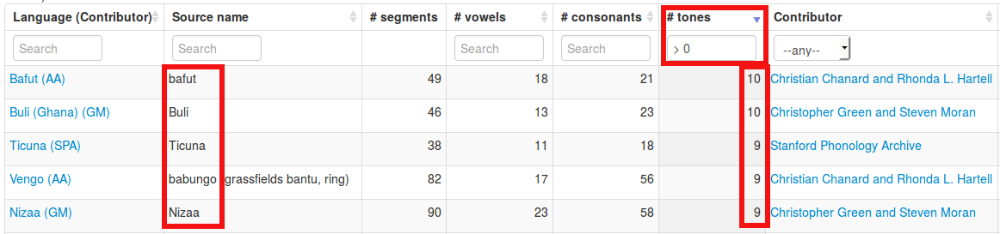

# Querying the database

Now we can inspect the data using SQL queries either running `sqlite3 qmss.sqlite` 

```sql
$ sqlite3 qmss.sqlite 
SQLite version 3.8.2 2013-12-06 14:53:30
Enter ".help" for instructions
Enter SQL statements terminated with a ";"
sqlite> SELECT count(*) FROM languoids;
18357
```

or by typing SQL
into SQLite Manager's *Execute SQL* pane.


Querying or selecting rows in a table is done using SQL's `SELECT` command, specifying the 
fields you want to retrieve and the name of the table, e.g.

```sql
SELECT glottocode, name, macroarea FROM languoids;
```

will return results as follows:

<table>
<TR><TH>glottocode</TH>
<TH>name</TH>
<TH>macroarea</TH>
</TR>
<TR><TD>aala1237</TD>
<TD>Aalawa</TD>
<TD>Papunesia</TD>
</TR>
<TR><TD>aant1238</TD>
<TD>Aantantara</TD>
<TD>Papunesia</TD>
</TR>
<TR><TD>aari1239</TD>
<TD>Aari</TD>
<TD>Africa</TD>
</TR>
<TR><TD>aasa1238</TD>
<TD>Aasax</TD>
<TD>Africa</TD>
</TR>
<TR><TD>aata1238</TD>
<TD>Aatasaara</TD>
<TD>Papunesia</TD>
</TR>
</table>

SQL provides keywords and construct to manipulate queries allowing
- [sorting](http://swcarpentry.github.io/sql-novice-survey/02-sort-dup.html)
- [filtering](http://swcarpentry.github.io/sql-novice-survey/03-filter.html)
- [calculating of new values](http://swcarpentry.github.io/sql-novice-survey/04-calc.html)
- [aggregating](http://swcarpentry.github.io/sql-novice-survey/06-agg.html)
- [combining data](http://swcarpentry.github.io/sql-novice-survey/07-join.html)
some of which we will encounter below when examining the data in our two tables.

We want to combine information about macroareas from table `languoids` with information about
tones in table `phonemes`.

So let's first examine how the information about macroareas is coded. We use the `DISTINCT` 
keyword to remove duplicate rows from the query results.

```sql
SELECT DISTINCT macroarea FROM languoids;
```

reults in 

<table>
<TR><TH>macroarea</TH>
</TR>
<TR><TD>Papunesia</TD>
</TR>
<TR><TD>Africa</TD>
</TR>
<TR><TD>Eurasia</TD>
</TR>
<TR><TD>South America</TD>
</TR>
<TR><TD>North America</TD>
</TR>
<TR><TD>Australia</TD>
</TR>
<TR><TD></TD>
</TR>
</table>

So there are 6 macroareas associated with languoids. But does each row have a macroarea coded?
To find out, we need to know a bit about how databases handle 
[missing data](http://swcarpentry.github.io/sql-novice-survey/05-null.html).
A missing value for a field is indicated by `null`, the "null value". To make these values more
easily visible in the terminal, we can set

```sql
sqlite> . nullvalue <null>
sqlite> SELECT DISTINCT macroarea FROM languoids;
Papunesia
Africa
Eurasia
South America
North America
Australia
<null>
```

Note that `null` is not really a value, though, e.g.
```sql
sqlite> SELECT count(DISTINCT macroarea) FROM languoids;
6
sqlite> SELECT count(*) FROM languoids WHERE macroarea = null;
0
sqlite> SELECT count(*) FROM languoids WHERE macroarea is null;
60
```

We have used the aggregation function `count` to aggregate information from all rows of the
result set.

We can examine the information about tones in the `phonemes` table in the same way:

```sql
sqlite> SELECT DISTINCT tone FROM phonemes;
0
+
<null>
```

So a phoneme is coded as being associated with tone by a value of `+`.
How many of these are there?

```sql
sqlite> SELECT count(*) FROM phonemes WHERE tone = '+';
2007
```

We used a `WHERE` clause to filter the set of phonemes by a certain value for one field.

In how many languages do they occur?

```sql
sqlite> SELECT count(distinct LanguageCode) FROM phonemes WHERE tone = '+';
526
```

So there are languages with more than one tonal phoneme. We can group phonemes by language
or more precisely by inventory and then count the number of grouped phonemes as follows:

```sql
SELECT 
    InventoryID, LanguageCode, LanguageName, count(*) AS tones
FROM 
    phonemes 
WHERE 
    tone = '+' 
GROUP BY 
    InventoryID, LanguageCode;
ORDER BY tones DESC;
```

<table>
<TR><TH>InventoryID</TH>
<TH>LanguageCode</TH>
<TH>LanguageName</TH>
<TH>tones</TH>
</TR>
<TR><TD>662</TD>
<TD>bfd</TD>
<TD>bafut</TD>
<TD>10</TD>
</TR>
<TR><TD>1390</TD>
<TD>bwu</TD>
<TD>Buli</TD>
<TD>10</TD>
</TR>
<TR><TD>661</TD>
<TD>bav</TD>
<TD>babungo</TD>
<TD>9</TD>
</TR>
<TR><TD>1317</TD>
<TD>sgi</TD>
<TD>Nizaa</TD>
<TD>9</TD>
</TR>
<TR><TD>115</TD>
<TD>tca</TD>
<TD>Ticuna</TD>
<TD>9</TD>
</TR>
</table>

To check our assumption that tones are coded with a `+` value for the field `tone`,
we compare this with the [PHOIBLE website](http://phoible.org/inventories):



A convenient way to store intermediate results (in a dynamic way) is via views, which behave
much like tables. You can create a view in SQLite running the following SQL:

```sql
CREATE VIEW tones_by_inventory AS 
    SELECT 
        InventoryID, LanguageCode, LanguageName, count(*) AS tones 
    FROM 
        phonemes 
    WHERE 
        tone = '+' 
    GROUP BY 
        LanguageCode, InventoryID;
```

or in SQLite Manager select
> View -> Create View
and fill in view name and the `SELECT` statement:


Note that PHOIBLE may have more than one inventory for an individual language. We can check
whether this is also the case for our view:

```sql
sqlite> SELECT count(*) FROM tones_by_inventory;
595
sqlite> SELECT count(distinct languagecode) FROM tones_by_inventory;
526
```

We can aggregate over all inventories for one language, taking the maximal number of tones
coded:

```sql
CREATE VIEW tones_by_language AS 
    SELECT 
        LanguageCode, max(tones) AS tones 
    FROM 
        tones_by_inventory
    GROUP BY 
        LanguageCode;
```

So what do we know about the number of tones per language? We can use a couple more standard
aggregation functions to find out:

```sql
SELECT 
    min(tones), max(tones), avg(tones), sum(tones)/cast(count(tones) AS float) 
FROM 
    tones_by_language;
```

yielding

<table>
<TR><TH>min(tones)</TH>
<TH>max(tones)</TH>
<TH>avg(tones)</TH>
<TH>sum(tones)/cast(count(tones) as float)</TH>
</TR>
<TR><TD>1</TD>
<TD>10</TD>
<TD>3.40684410646388</TD>
<TD>3.40684410646388</TD>
</TR>
</table>

Notes:
- SQLite undertands the usual arithmetic operators `+ - * /` to calculate new values.
- Fields are typed and operators or functions typically do not coerce their arguments into the
  required types. So the `cast` function is used above to make sure we are applying floating
  point division, rather than integer division (with remainder).


If we want to compare tone languages with languages without tone, we should include all
other languages present in PHOIBLE giving them a number of tones of `0`. This can be done
using a special kind of `JOIN`, a [`LEFT OUTER JOIN`](https://en.wikipedia.org/wiki/Join_%28SQL%29#Left_outer_join):

```sql
SELECT 
    p.LanguageCode, coalesce(t.tones, 0) AS tones
FROM
    (SELECT DISTINCT LanguageCode FROM phonemes WHERE source != 'upsid') AS p 
LEFT OUTER JOIN
    tones_by_language AS t
ON
    p.LanguageCode = t.LanguageCode;
```

Notes:
- A `LEFT OUTER JOIN` makes sure that the result set contains at least one row for each row
  the left table. If no row matching the `ON` condition can be found in the right table, the
  result row will be filled up with `null`.
- We use the [function `coalesce`](https://www.sqlite.org/lang_corefunc.html) to select the
  value `0` for a row where `LanguageCode` does not appear in `tones_by_language`, and thus 
  `t.tones` is `null`.
- The result set of a `SELECT` expression behaves much like a table; in particular, it can be
  used in the `FROM` list of another `SELECT` expression.

Since we want to join the result set of the above `SELECT` with the other tables, we put it in
a view:

```sql
CREATE VIEW tones AS
    SELECT 
        p.LanguageCode, coalesce(t.tones, 0) AS tones
    FROM
        (SELECT DISTINCT LanguageCode FROM phonemes WHERE source != 'upsid') AS p 
    LEFT OUTER JOIN
        tones_by_language AS t
    ON
        p.LanguageCode = t.LanguageCode;
```


We can only combine information from two tables if they have something in common. In our case,
`languoids.isocodes` stores (potentially multiple) ISO codes associated with a lnaguoid, and
`tones.LanguageCode` stores single ISO codes. To match records of the two tables, we have to
further investigate the values in `languoids.isocodes`:

```
sqlite> SELECT max(length(isocodes)) FROM languoids;
3
```

Ok, so there is at most one three-letter ISO code per languoid. Let's see if these ISO codes
are all distinct:

```
sqlite> SELECT count(*) FROM languoids WHERE length(isocodes) = 3;
7361
```

```
sqlite> SELECT count(distinct isocodes) FROM languoids WHERE length(isocodes) = 3;
7361
```

Good! Having established that `languoids.isocodes` does only hold unique three-letter
ISO codes (or `null`), we can use this field to `JOIN` the two tables:

The D-PLACE data is coded for ISO codes as well as for Glottocodes, thus we have two alternatives
for joining. Let's see which one is prefereable:

```sql
sqlite> select count(iso_code) from precipitation;
1286
sqlite> select count(distinct iso_code) from precipitation;
1095
sqlite> select count(glottocode) from precipitation;
1618
sqlite> select count(distinct glottocode) from precipitation;
1303
```

Given that there are more than 200 more societies with Glottocodes, we just take "more" as
"better" and go with Glottocodes:

```sql
CREATE VIEW precipitation_by_glottocode AS 
    SELECT 
        glottocode, Language_family, avg(precipitation) AS precipitation
    FROM 
        precipitation 
    WHERE 
        glottocode IS NOT null
    GROUP BY 
        glottocode;
```


Now we can put our dataset together:


```sql
SELECT 
    g.glottocode, g.name, g.macroarea, g.latitude, g.longitude, d.Language_family, d.precipitation, p.tones 
FROM 
    languoids AS g 
JOIN 
    tones AS p 
ON 
    g.isocodes = p.LanguageCode 
JOIN 
    precipitation_by_glottocode AS d 
ON 
    d.glottocode = g.glottocode 
ORDER BY 
    d.Language_family, g.name;
```

<table>
<TR><TH>g.glottocode</TH>
<TH>g.name</TH>
<TH>g.macroarea</TH>
<TH>g.latitude</TH>
<TH>g.longitude</TH>
<TH>d.Language_family</TH>
<TH>d.precipitation</TH>
<TH>p.tones</TH>
</TR>
<TR><TD>kaba1278</TD>
<TD>Kabardian</TD>
<TD>Eurasia</TD>
<TD>43.5082</TD>
<TD>43.3918</TD>
<TD>Abkhaz-Adyge</TD>
<TD>56.5765</TD>
<TD>0</TD>
</TR>
<TR><TD>afar1241</TD>
<TD>Afar</TD>
<TD>Africa</TD>
<TD>12.2281</TD>
<TD>41.8083</TD>
<TD>Afro-Asiatic</TD>
<TD>14.991</TD>
<TD>0</TD>
</TR>
<TR><TD>amha1245</TD>
<TD>Amharic</TD>
<TD>Africa</TD>
<TD>11.7082</TD>
<TD>39.5435</TD>
<TD>Afro-Asiatic</TD>
<TD>75.97866667</TD>
<TD>0</TD>
</TR>
<TR><TD>arbo1245</TD>
<TD>Arbore</TD>
<TD>Africa</TD>
<TD>4.92183</TD>
<TD>36.7986</TD>
<TD>Afro-Asiatic</TD>
<TD>53.38333333</TD>
<TD>0</TD>
</TR>
<TR><TD>bili1260</TD>
<TD>Bilin</TD>
<TD>Africa</TD>
<TD>15.7833</TD>
<TD>38.3917</TD>
<TD>Afro-Asiatic</TD>
<TD>15.9045</TD>
<TD>0</TD>
</TR>
</table>

Let's turn this result set into a view and do some initial exploration of this dataset.

```sql
CREATE VIEW dataset AS
    SELECT 
        g.glottocode, g.name, g.macroarea, g.latitude, g.longitude, d.Language_family, d.precipitation, p.tones 
    FROM 
        languoids AS g 
    JOIN 
        tones AS p 
    ON 
        g.isocodes = p.LanguageCode 
    JOIN 
        precipitation_by_glottocode AS d 
    ON 
        d.glottocode = g.glottocode 
    ORDER BY 
        d.Language_family, g.name;  
```

How big is our sample of the world's languages?

```sql
sqlite> SELECT count(*) FROM dataset;
466
sqlite> SELECT count(*) FROM dataset WHERE tones > 0;
161
```

Grouping tone languages by macroarea:

```sql
SELECT macroarea, count(*) AS tone_languages FROM dataset WHERE tones > 0 GROUP BY macroarea;
```

Resulting in:

<table>
<TR><TH>macroarea</TH>
<TH>tone_languages</TH>
</TR>
<TR><TD>Africa</TD>
<TD>140</TD>
</TR>
<TR><TD>Eurasia</TD>
<TD>10</TD>
</TR>
<TR><TD>North America</TD>
<TD>8</TD>
</TR>
<TR><TD>Papunesia</TD>
<TD>1</TD>
</TR>
<TR><TD>South America</TD>
<TD>2</TD>
</TR>
</table>

So [compared with WALS](http://wals.info/feature/13A?v1=a000) our dataset seems to be a 
reasonable sample.


Let's have a first peek at the relation between precipitation and tones:

```sql
sqlite> SELECT avg(precipitation) FROM dataset WHERE tones > 0;
102.076166837901
sqlite> SELECT avg(precipitation) FROM dataset WHERE tones = 0;
118.320957924165
```

Hm. More rain on average for languages without tones.
How does this look broken down to macroareas?

```sql
SELECT macroarea, avg(precipitation) FROM dataset WHERE tones > 0 GROUP BY macroarea ORDER BY macroarea;
```

<table>
<TR><TH>macroarea</TH>
<TH>avg(precipitation)</TH>
</TR>
<TR><TD>Africa</TD>
<TD>104.032449402479</TD>
</TR>
<TR><TD>Eurasia</TD>
<TD>96.237083336</TD>
</TR>
<TR><TD>North America</TD>
<TD>36.291034724375</TD>
</TR>
<TR><TD>Papunesia</TD>
<TD>203.6416667</TD>
</TR>
<TR><TD>South America</TD>
<TD>206.68958335</TD>
</TR>
</table>

```sql
SELECT macroarea, avg(precipitation) FROM dataset WHERE tones = 0 GROUP BY macroarea ORDER BY macroarea;
```

<table>
<TR><TH>macroarea</TH>
<TH>avg(precipitation)</TH>
</TR>
<TR><TD>Africa</TD>
<TD>91.5205032050128</TD>
</TR>
<TR><TD>Australia</TD>
<TD>81.8263055683333</TD>
</TR>
<TR><TD>Eurasia</TD>
<TD>91.3756792945455</TD>
</TR>
<TR><TD>North America</TD>
<TD>82.5951565013728</TD>
</TR>
<TR><TD>Papunesia</TD>
<TD>212.319091955172</TD>
</TR>
<TR><TD>South America</TD>
<TD>151.575119609094</TD>
</TR>
</table>

Hm. Languages in North America seem to be a bit of an outlier. 

Anyway, the dataset looks interesting enough to export it to CSV and play around with it
in R!

Notes:
- A standardized query language like SQL allows re-using the same analyses tools with different
  database managers, and even with different relational databases.
- While SQL is case insensitive, it is customary to write SQL keywords like `SELECT`, `FROM`
  and `WHERE` in uppercase, to clearly distinguish them from identifiers for tables and columns.
- There is no defined default ordering of rows returned by a query. So you should always specify
  an explicit order to make query results replicable.
- SQL commands are terminated with a semicolon.
- The fields or values to be selected as well as the tables or expressions from which to select
  can be aliased using `AS`, to allow referencing from other parts of a query.
- SQL provides a standardized, somewhat portable way to declaratively describe data manipulation.
  In our example, the final query is arguably more readable and maintainable than equivalent
  code in a procedural language like python or R.


## Next section

[Exporting to CSV](05-exporting-csv.md)
