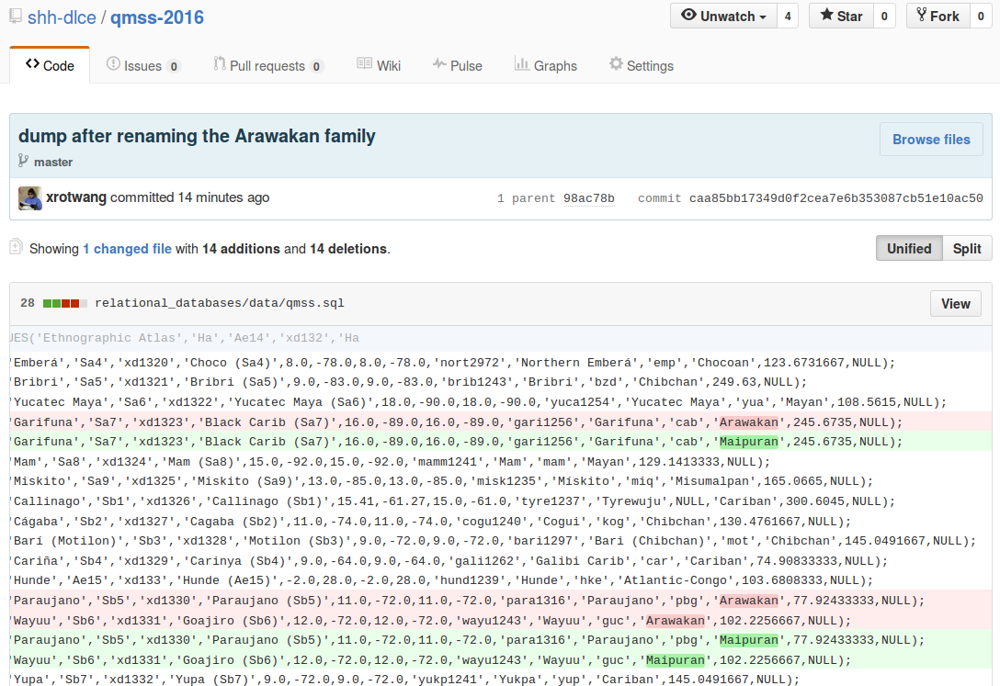

# Exporting data

## Using sqlite3

sqlite3 supports export to CSV as follows:

```bash
sqlite> .header on
sqlite> .mode csv
sqlite> .output dataset.csv
sqlite> SELECT * FROM dataset;
sqlite> .output stdout
```

## Using SQLite Manager

Choose
> View -> Export View


Configure the export, click "OK", select an output file and enjoy!


## SQLite and version control

While the sqlite database file is quite portable and could be shared e.g. using
a service like dropbox, this may not be the best option for collaboration or
backup. Since the sqlite file is a binary file, it is also not well suited for
version control systems like git.

But SQLite (like most relational databases) supports dumping a database to SQL,
which in turn is a line-based text format, perfectly suited for version control.

Thus, we can dump and restore a database to/from SQL:

```bash
$ sqlite3 qmss.sqlite .dump > qmss.sql
$ sqlite3 qmss_restored.sqlite < qmss.sql
```

Notes:
- Since SQL includes a DDL, the SQL dump can not only contain the raw data, but also
  descriptions of all necessary DB objects like tables, columns and views.
- Thus, the second command above will create an SQLite database from scratch, which
  after running the dumped SQL behaves just like the one the dump was created from.
- Unfortunately - despite SQL being a specified standard - such SQL dumps are not really
  portable across SQL database systems.

This will give us all the advantages of version control to make changes to our
data transparent. E.g. updating data using SQL like

```sql
UPDATE precipitation SET Language_family = 'Maipuran' WHERE Language_family = 'Arawakan';
```

will result in a changeset of the SQL dump [looking like this](https://github.com/shh-dlce/qmss-2016/commit/caa85bb17349d0f2cea7e6b353087cb51e10ac50):




## Next section

[What's next?](06-whats-next.md)
