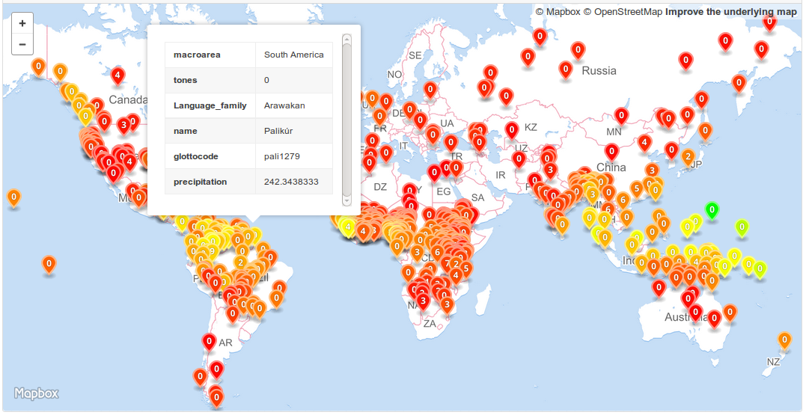

# What's next?

## Build automation

To make the creation of our dataset from the raw source data replicable, we'd like to
turn this process from an interactive into an automatic one.

We learned that `SELECT` expressions can be used as elements in the `FROM` clause; thus,
we can plug our view definitions into the final query to get one big `SELECT` statement
that pulls together our dataset:

```sql
SELECT
  g.glottocode      AS glottocode,
  g.name            AS name,
  g.macroarea       AS macroarea,
  g.latitude        AS latitude,
  g.longitude       AS longitude,
  d.Language_family AS family,
  d.precipitation   AS precipitation,
  p.tones           AS tones
FROM
  languoids AS g
  JOIN
  (
    SELECT
      p.LanguageCode,
      coalesce(t.tones, 0) AS tones
    FROM
      (SELECT DISTINCT LanguageCode
       FROM phonemes
       WHERE source != 'upsid') AS p
      LEFT OUTER JOIN
      (
        SELECT
          LanguageCode,
          max(tones) AS tones
        FROM
          (
            SELECT
              InventoryID,
              LanguageCode,
              LanguageName,
              count(*) AS tones
            FROM
              phonemes
            WHERE
              tone = '+'
            GROUP BY
              LanguageCode, InventoryID
          ) AS x
        GROUP BY
          LanguageCode
      ) AS t
        ON
          p.LanguageCode = t.LanguageCode
  ) AS p
    ON
      g.isocodes = p.LanguageCode
  JOIN
  (
    SELECT
      glottocode,
      Language_family,
      avg(precipitation) AS precipitation
    FROM
      precipitation
    WHERE
      glottocode IS NOT NULL
    GROUP BY
      glottocode
  ) AS d
    ON
      d.glottocode = g.glottocode
ORDER BY
  d.Language_family, g.name;
```

While this may look a bit overwhelming, constructing this query was kind of natural, and now
that we have it, we can simply [store it in a file](query.sql).

We further note that the `sqlite3` command can be called non-interactively, passing in
arguments that specify the output mode and SQL to execute:

```bash
sqlite3 -csv -header qmss.sqlite "`cat query.sql`"
```

So assembling our dataset from the source files can be done with 
[a 4-line shell script](create_dataset.sh) (plus one SQL query):

```bash
csvsql --db=sqlite:///qmss.sqlite --insert --tables languoids -q '"' data/languages-and-dialects-geo.csv
csvsql --db=sqlite:///qmss.sqlite --insert --tables phonemes -t data/phoible-by-phoneme.tsv 
csvsql --db=sqlite:///qmss.sqlite --insert --tables precipitation data/dplace-societies-2016-4-19-clean.csv
sqlite3 -csv -header qmss.sqlite "`cat query.sql`" > dataset.csv
```


## Visualization

Our [resulting CSV file](data/dataset.csv) could easily be converted to GeoJSON using a 
service such as [csv2geojson](http://mapbox.github.io/csv2geojson/)
for [basic visualization on a map](data/dataset.geojson).

With a bit more [work in python](geojson.py) this can be turned into a 
[visualization](data/dataset2.geojson) of
- geography
- precipitation (via marker colors)
- tonality (via marker icons)




## R

And of course there's a lot of further analysis to be done!
