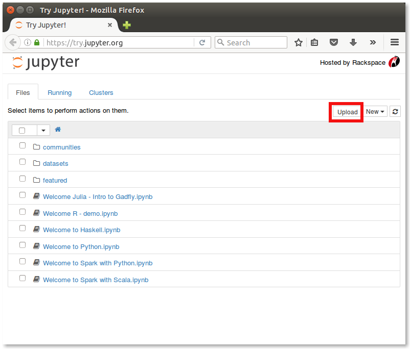
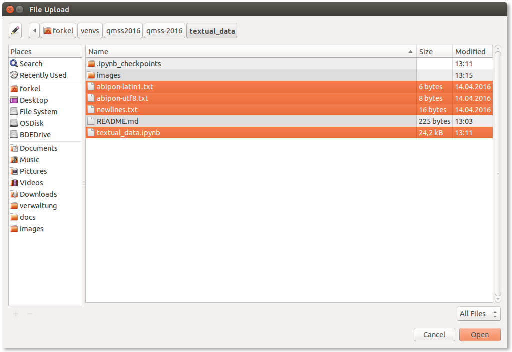
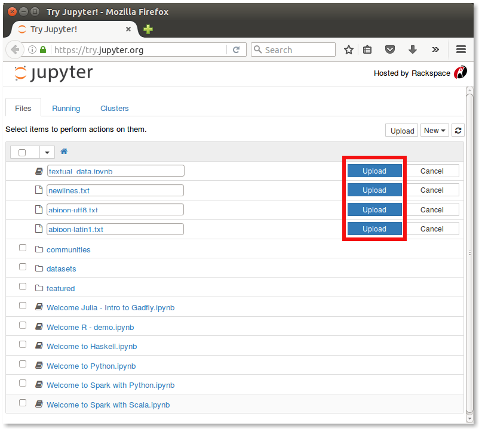
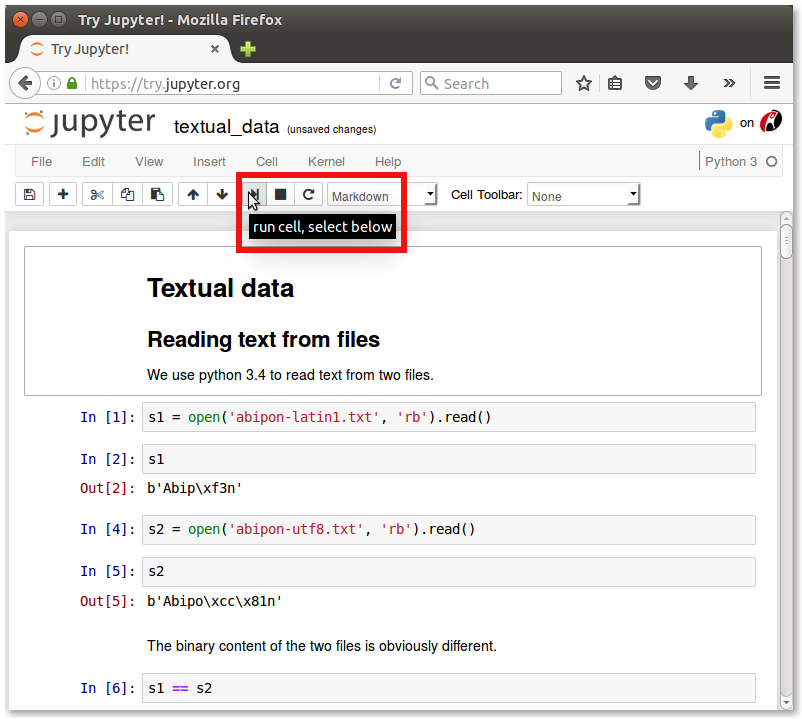

Textual data
------------

This tutorial on textual data is implemented as Jupyter Notebook. It can be run by visiting the
[Try Jupyter!](https://try.jupyter.org/) service and uploading notebook and data files:

Click the `upload` button and select the following files from your local clone of the
QMSS2016 repository:

Click the 4 `upload` buttons to start the upload:

Once the upload finished, click the notebook file `textual_data.ipynb` to launch the
notebook:

Now you can step through the tutorial (and experiment with the data and code) by clicking the
`play` button for each cell:

