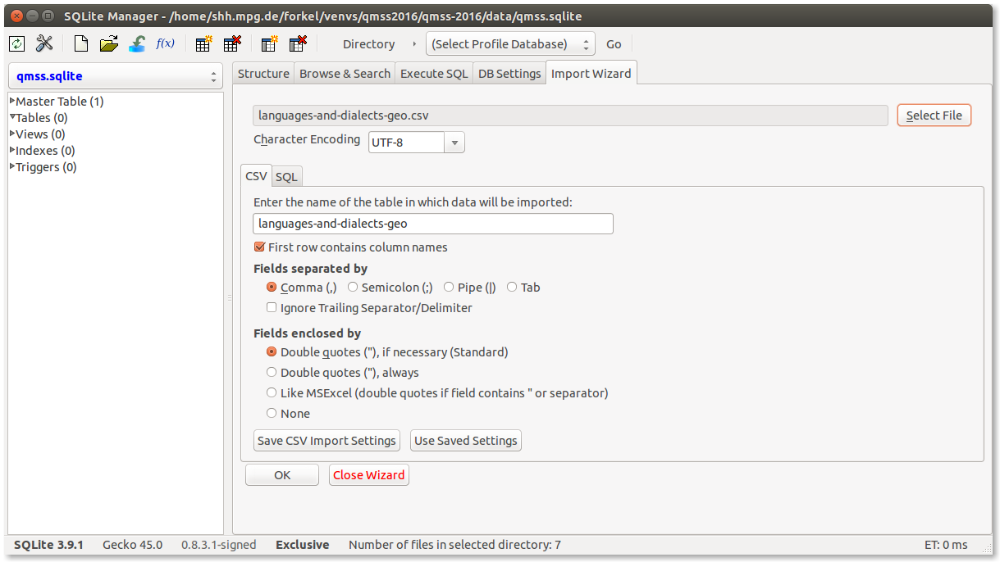
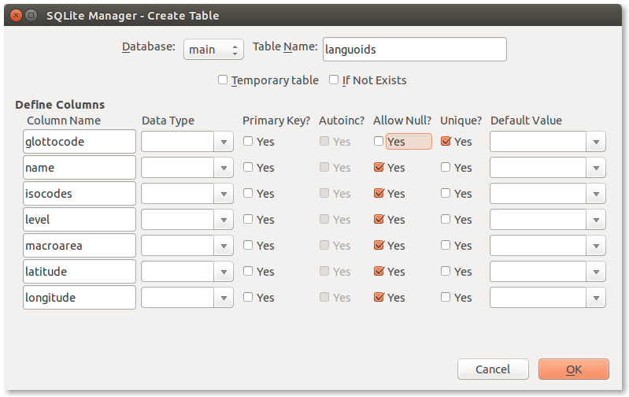
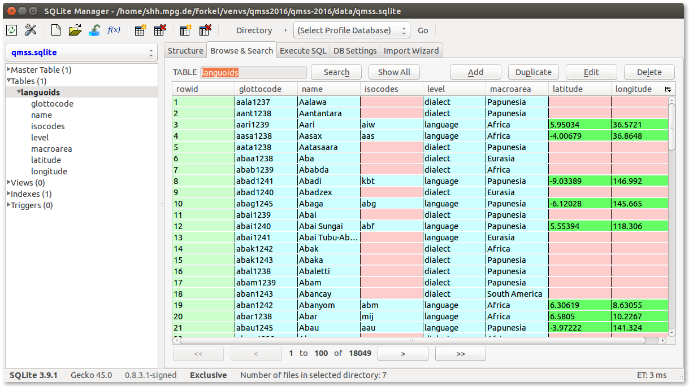
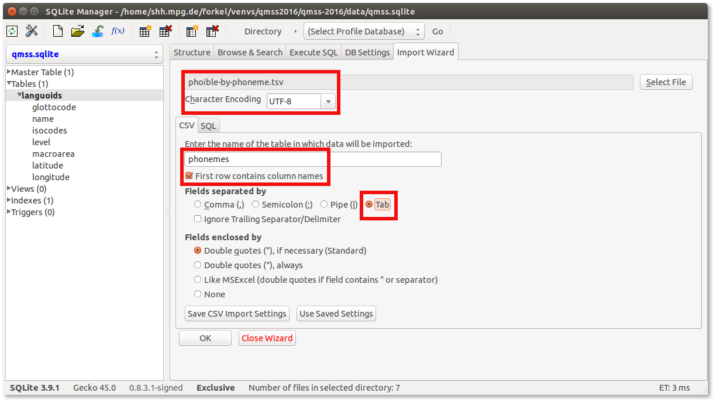
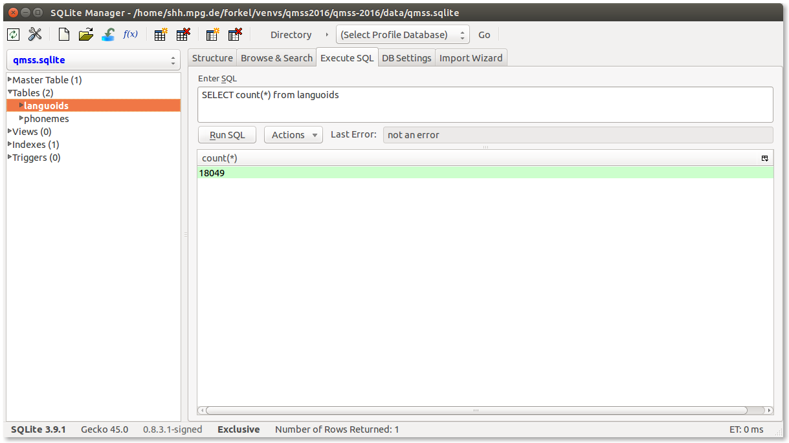
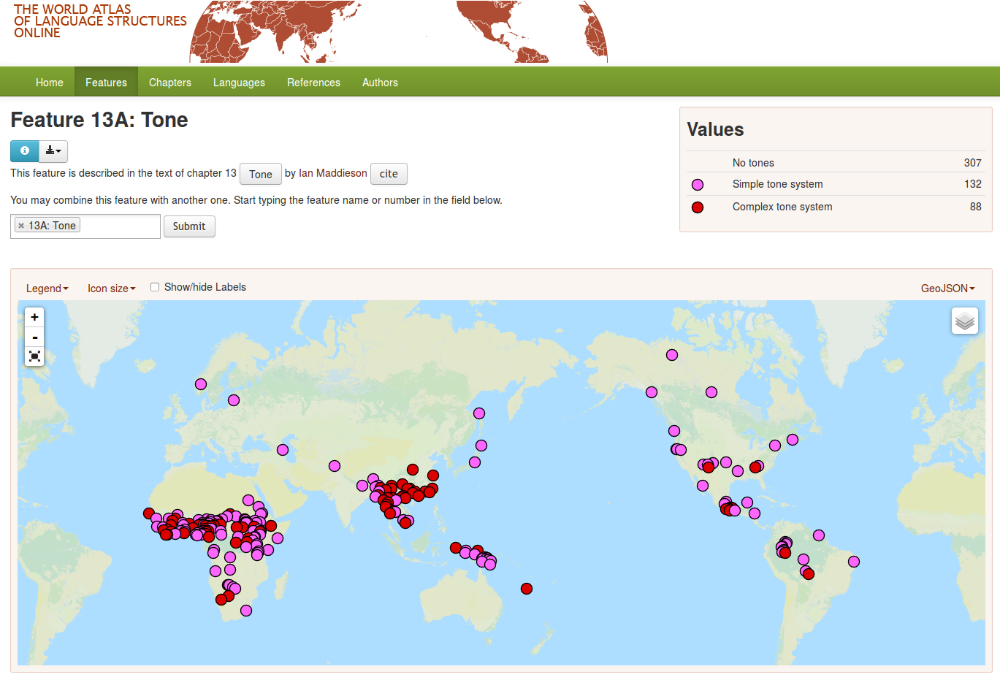
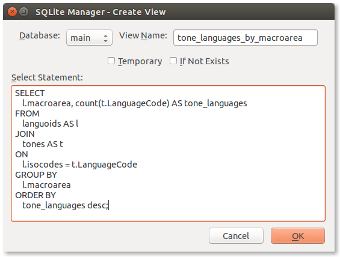

# Relational databases

The [software carpentry](http://software-carpentry.org/) lesson on 
[Databases and SQL](http://swcarpentry.github.io/sql-novice-survey/) describes relational
databases as

> a way to store and manipulate information. Databases are arranged as tables. Each table 
> has columns (also known as fields) that describe the data, and rows (also known as records) 
> which contain the data.

> When we are using a spreadsheet, we put formulas into cells to calculate new values based 
> on old ones. When we are using a database, we send commands (usually called queries) to a 
> database manager: a program that manipulates the database for us. The database manager does 
> whatever lookups and calculations the query specifies, returning the results in a tabular 
> form that we can then use as a starting point for further queries.

> Queries are written in a language called SQL, which stands for “Structured Query Language”. 
> SQL provides hundreds of different ways to analyze and recombine data. We will only look at 
> a handful of queries, but that handful accounts for most of what scientists do.

Using relational databases is motivated as follows:

> Three common options for storage are text files, spreadsheets, and databases. Text files 
> are easiest to create, and work well with version control, but then we would have to build 
> search and analysis tools ourselves. Spreadsheets are good for doing simple analyses, but 
> they don’t handle large or complex data sets well. Databases, however, include powerful 
> tools for search and analysis, and can handle large, complex data sets. These lessons will 
> show how to use a database to explore [...] data.


## Tutorial: Data wrangling with SQLite

In this tutorial we learn how to use a relational database to merge and analyse CSV data from different sources.

The tutorial requires 
- [csvkit](https://csvkit.readthedocs.org/en/0.9.1/index.html) (optional)
- a sqlite database manager, either [sqlite](https://www.sqlite.org/download.html) or 
  alternatively [SQLite Manager for Firefox](https://addons.mozilla.org/en-US/firefox/addon/sqlite-manager/)

We will use the following data:
- [Glottolog languages and dialects](data/languages-and-dialects-geo.csv) downloaded from http://glottolog.org/static/download/2.7/languages-and-dialects-geo.csv
- [PHOIBLE phoneme data](data/phoible-by-phoneme.tsv) downloaded from https://raw.githubusercontent.com/phoible/dev/master/data/phoible-by-phoneme.tsv

Our goal is to figure out how [tone languages](https://simple.wikipedia.org/wiki/Tone_language) 
are distributed across [Glottolog macroareas](http://glottolog.org/meta/glossary#macroarea).


### Inspecting CSV data

We downloaded a CSV file containing data about languages and dialects from Glottolog and
a TSV file containing the PHOIBLE database on phoneme inventories (see [README](data/README.md)).

Let's do a crude size estimate of the Glottolog data, counting the lines in the file:

```bash
$ wc -l data/languages-and-dialects-geo.csv 
18358 data/languages-and-dialects-geo.csv
```
 

Now we inspect the file using csvkit's `csvstat` command.
In general it is advisable to constrain the amount of guessing csvkit has to do by specifying all we know about a CSV file. For example, [RFC 4180](https://www.ietf.org/rfc/rfc4180.txt) (the de facto specification of CSV) allows only double quote `"` as quote character (to be used in case field content contains a comma or newline).

```bash
$ csvstat -q '"' data/languages-and-dialects-geo.csv
  1. glottocode
	<class 'str'>
	Nulls: False
	Unique values: 18357
	Max length: 8
  2. name
	<class 'str'>
	Nulls: True
	Unique values: 18227
	5 most frequent values:
		Gova:	3
		Yana:	2
		Iko:	2
		Unggumi:	2
		Hamba:	2
	Max length: 58
  3. isocodes
	<class 'str'>
	Nulls: True
	Unique values: 7361
	Max length: 4
  4. level
	<class 'str'>
	Nulls: False
	Values: language, dialect
  5. macroarea
	<class 'str'>
	Nulls: True
	Unique values: 6
	5 most frequent values:
		Africa:	5911
		Eurasia:	4992
		Papunesia:	4817
		South America:	1041
		North America:	995
	Max length: 13
  6. latitude
	<class 'float'>
	Nulls: True
	Min: -55.2748
	Max: 73.1354
	Sum: 57961.53543824342
	Mean: 7.874138763516291
	Median: 6.08134
	Standard Deviation: 18.678027079778794
	Unique values: 7204
	5 most frequent values:
		23.6818:	10
		40.0:	5
		21.8375:	5
		23.086:	5
		25.0:	4
  7. longitude
	<class 'float'>
	Nulls: True
	Min: -178.785
	Max: 179.306
	Sum: 372863.3632390997
	Mean: 50.6539007253226
	Median: 45.152856
	Standard Deviation: 81.61051507133911
	Unique values: 7162
	5 most frequent values:
		107.184:	10
		107.362:	5
		103.464:	5
		10.2166:	4
		142.462:	4

Row count: 18357
```

Notes:
- The row count matches our expectation from counting the lines in the file. (It could be lower, 
  though, because CSV does allow newlines in field content.)
- csvkit also detected plausible data types for the fields; in particular, latitude and longitude
  were detected as containing floating point numbers.
- Running csvstat on the 8.2 MB PHOIBLE file with 75,388 rows takes > 10 secs on a pretty fast
  machine.


### Inserting the data into sqlite

Now we insert the data into a relational database for further analysis.

Note: An sqlite database file pre-loaded with the two datasets is available as `qmss.sqlite`
in [this repository](data/).

#### Using SQLite Manager

Unfortunately the CSV import of SQLite Manager (0.8.3) does not handle single quotes in the
data well. The single quote `'` is a delimiter in SQL, thus has to be escaped as `\'` when
used within string literals in SQL. So before importing the data from Glottolog into SQLite Manager,
we need to fix this:

```
$ python
Python 3.4.3 (default, Oct 14 2015, 20:28:29)
>>> c = open('data/languages-and-dialects-geo.csv', encoding='utf8').read()
>>> with open('data/languages-and-dialects-geo-quoted.csv', 'w', encoding='utf8') as fp:
...   fp.write(c.replace("'", "\\'"))
... 
```

Choose
> Database -> New Database 
then give a name and directory where to store the DB.

Then
> Database -> Import
will open the *Import Wizard* pane, where you input the data shown below



You are then prompted to edit the table's schema



After importing the data, you should be able to browse the table:



Same for phonemes, select VARCHAR for all!




#### Using csvkit

Doing this with csvkit's `csvsql` command is easy.

We can take a peek at the table csvkit is going to create, running

```bash
$ csvsql --tables languoids -q '"' data/languages-and-dialects-geo.csv
CREATE TABLE languoids (
	glottocode VARCHAR(8) NOT NULL, 
	name VARCHAR(58), 
	isocodes VARCHAR(4), 
	level VARCHAR(8) NOT NULL, 
	macroarea VARCHAR(13), 
	latitude FLOAT, 
	longitude FLOAT
);
```

and then insert the data running

```bash
$ csvsql --tables languoids --insert -q '"' data/languages-and-dialects-geo.csv
$ csvsql --tables phonemes --insert -t data/languages-and-dialects-geo.csv
```


#### Summary

We now have an sqlite database containing two tables `languoids` and `phonemes` defined as

```
CREATE TABLE languoids (
	glottocode VARCHAR(8) NOT NULL, 
	name VARCHAR(58), 
	isocodes VARCHAR(4), 
	level VARCHAR(8) NOT NULL, 
	macroarea VARCHAR(13), 
	latitude FLOAT, 
	longitude FLOAT
);
```

and 

```
CREATE TABLE phonemes (
	"LanguageCode" VARCHAR(3) NOT NULL, 
	"LanguageName" VARCHAR(79) NOT NULL, 
	"SpecificDialect" VARCHAR(51), 
	"Phoneme" VARCHAR(11) NOT NULL, 
	"Allophones" VARCHAR(34), 
	"Source" VARCHAR(6) NOT NULL, 
	"GlyphID" VARCHAR(54) NOT NULL, 
	"InventoryID" INTEGER NOT NULL, 
	tone VARCHAR(4), 
	stress VARCHAR(4), 
	syllabic VARCHAR(4), 
	short VARCHAR(4), 
	long VARCHAR(4), 
	consonantal VARCHAR(4), 
	sonorant VARCHAR(7), 
	continuant VARCHAR(5), 
	"delayedRelease" VARCHAR(4), 
	approximant VARCHAR(4), 
	tap VARCHAR(4), 
	trill VARCHAR(4), 
	nasal VARCHAR(7), 
	lateral VARCHAR(4), 
	labial VARCHAR(5), 
	round VARCHAR(4), 
	labiodental VARCHAR(4), 
	coronal VARCHAR(5), 
	anterior VARCHAR(4), 
	distributed VARCHAR(4), 
	strident VARCHAR(5), 
	dorsal VARCHAR(5), 
	high VARCHAR(5), 
	low VARCHAR(5), 
	front VARCHAR(5), 
	back VARCHAR(5), 
	tense VARCHAR(4), 
	"retractedTongueRoot" VARCHAR(4), 
	"advancedTongueRoot" VARCHAR(4), 
	"periodicGlottalSource" VARCHAR(5), 
	"epilaryngealSource" VARCHAR(4), 
	"spreadGlottis" VARCHAR(4), 
	"constrictedGlottis" VARCHAR(4), 
	fortis VARCHAR(4), 
	"raisedLarynxEjective" VARCHAR(4), 
	"loweredLarynxImplosive" VARCHAR(4), 
	click VARCHAR(4)
);
```

Each row in the `languoids` table contains information about a different language or dialect.

Each row in the `phonemes` table contains information about one phoneme encountered in a phoneme
inventory associated with a language.

Database fields are explicitely typed (as opposed to columns in CSV files).


### Querying the database

Now we can inspect the data either running `sqlite3 qmss.sqlite` 

```bash
$ sqlite3 qmss.sqlite 
SQLite version 3.8.2 2013-12-06 14:53:30
Enter ".help" for instructions
Enter SQL statements terminated with a ";"
sqlite> SELECT count(*) FROM languoids;
18357
```

or by typing SQL
into SQLite Manager's *Execute SQL* pane.




Querying or selecting rows in a table is done using SQL's `SELECT` command, specifying the 
fields you want to retrieve and the name of the table, e.g.

```sql
SELECT glottocode, name FROM languoids;
```

SQL provides keywords and construct to manipulate queries allowing
- [sorting](http://swcarpentry.github.io/sql-novice-survey/02-sort-dup.html)
- [filtering](http://swcarpentry.github.io/sql-novice-survey/03-filter.html)
- [calculating of new values](http://swcarpentry.github.io/sql-novice-survey/04-calc.html)
- [aggregating](http://swcarpentry.github.io/sql-novice-survey/06-agg.html)
- [combining data](http://swcarpentry.github.io/sql-novice-survey/07-join.html)
some of which we will encounter below when examining the data in our two tables.

We want to combine information about macroareas from table `languoids` with information about
tones in table `phonemes`.

So let's first examine how the information about macroareas is coded. We use the `DISTINCT` 
keyword to remove duplicate rows from the query results.

```sql
SELECT DISTINCT macroarea FROM languoids;
```

So there are 6 macroareas associated with languoids. But does each row have a macroarea coded?
To find out, we need to know a bit about how databases handle [missing data](http://swcarpentry.github.io/sql-novice-survey/05-null.html).
A missing value for a field is indicated by `null`, the "null value". To make these values more
easily visible in the terminal, we can set

```sql
sqlite> . nullvalue <null>
sqlite> SELECT DISTINCT macroarea FROM languoids;
Papunesia
Africa
Eurasia
South America
North America
Australia
<null>
```

Note that `null` is not really a value, though, e.g.
```sql
sqlite> SELECT count(DISTINCT macroarea) FROM languoids;
6
```

We have used the aggregation function `count` to aggregate information from all rows of the
result set.

We can examine the information about tones in the `phonemes` table in the same way:

```sql
sqlite> SELECT DISTINCT tone FROM phonemes;
0
+
NA
```

So a phoneme is coded as being associated with tone by a value of `+`.
How many of these are there?

```sql
sqlite> SELECT count(*) FROM phonemes WHERE tone = '+';
2007
```

We used a `WHERE` clause to filter the set of phonemes by a certain value for one field.

In how many languages do they occur?

```sql
sqlite> SELECT count(distinct LanguageCode) FROM phonemes WHERE tone = '+';
526
```

So there are languages with more than one tonal phoneme. We can group phonemes by language
or more precisely by inventory and then count the number of grouped phonemes as follows:

```sql
SELECT 
    InventoryID, LanguageCode, count(*) AS tones 
FROM 
    phonemes 
WHERE 
    tone = '+' 
GROUP BY 
    InventoryID, LanguageCode;
```

A convenient way to store intermediate results (in a dynamic way) is via views, which behave
much like tables:

```sql
CREATE VIEW tones AS 
    SELECT 
        InventoryID, LanguageCode, count(*) AS tones 
    FROM 
        phonemes 
    WHERE 
        tone = '+' 
    GROUP BY 
        LanguageCode, InventoryID;
```

So what do we know about the number of tones per language? We can use a couple more standard
aggregation functions to find out:

```sql
sqlite> SELECT min(tones), max(tones), avg(tones), sum(tones)/cast(count(tones) as float) FROM tones;
1|10|3.37310924369748|3.37310924369748
```


We can only combine information from two tables if they have something in common. In our case,
`languoids.isocodes` stores (potentially multiple) ISO codes associated with a lnaguoid, and
`tones.LanguageCode` stores single ISO codes. To match records of the two tables, we have to
further investigate the values in `languoids.isocodes`:

```
sqlite> SELECT max(length(isocodes)) FROM languoids;
3
```

Ok, so there is at most one three-letter ISO code per languoid. Let's see if these ISO codes
are all distinct:

```
sqlite> select count(*) from languoids where length(isocodes) = 3;
7361
```

```
sqlite> select count(distinct isocodes) from languoids where length(isocodes) = 3;
7361
```

Good! Having established that `languoids.isocodes` does only hold unique three-letter
ISO codes (or `null`), we can use this field to `JOIN` the two tables:

```sql
SELECT 
    macroarea, name, isocodes 
FROM 
    languoids 
JOIN 
    tones 
ON 
    isocodes = LanguageCode;
```

```sql
sqlite> SELECT macroarea, name, isocodes FROM languoids JOIN tones ON isocodes = LanguageCode ORDER BY name LIMIT 5;
Africa|Abar|mij
Africa|Abidji|abi
Africa|Abua|abn
Africa|Abure|abu
Africa|Acoli|ach
```

Finally, we can group by macroarea to get the distribution we wanted to calculate:

```sql
SELECT 
    l.macroarea, count(t.LanguageCode) AS tone_languages 
FROM 
    languoids AS l 
JOIN 
    tones AS t 
ON 
    l.isocodes = t.LanguageCode
GROUP BY
    l.macroarea
ORDER BY
    tone_languages desc;
```

Resulting in:

```
Africa|528
Eurasia|28
North America|19
Papunesia|7
South America|6
```

Which - when [compared with WALS](http://wals.info/feature/13A?v1=a000) - seems to be a plausible result:



Notes:
- A standardized query language like SQL allows re-using the same analyses tools with different
  database managers, and even with different relational databases.
- While SQL is case insensitive, it is customary to write SQL keywords like `SELECT`, `FROM`
  and `WHERE` in uppercase, to clearly distinguish them from identifiers for tables and columns.
- There is no defined default ordering of rows returned by a query. So you should always specify
  an explicit order to make query results replicable.
- SQL commands are terminated with a semicolon.


### Exporting query results to CSV

sqlite3 supports export to CSV as follows:

```bash
sqlite> .header on
sqlite> .mode csv
sqlite> .output macroareas.csv
sqlite> select macroarea, count(glottocode) as c from languoids where level = 'language' group by macroarea order by c desc;
sqlite> .output stdout
```

To export the results of a query with SQLite Manager we can again make use of a `VIEW`:

> View -> Create View



Then 

> View -> Export View


Configure the export, click "OK", select an output file and enjoy!
